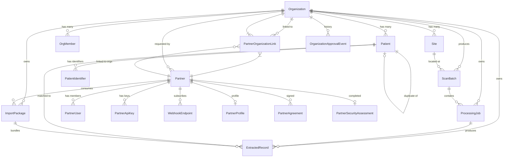

# Pierflow data model

_Generated from `prisma/schema.prisma` as of the current migration set. Re-generate when you add or drop a model._

## How to read this document

The Pierflow database has three distinct domains that interact at well-defined seams:

1. **Tenancy** — who can act on whose data: Organizations, Partners, the humans who belong to each, and the API keys that authorise machine access.
2. **Records pipeline** — the lifecycle a captured page goes through: ScanBatch → ProcessingJob → ExtractedRecord, with Patients reconciled along the way.
3. **Consumption** — how the data gets to a downstream system: ImportPackages, WebhookEndpoints, and the AuditLog that records who saw what.

Every model uses `cuid()` ids so we never expose sequential integers in URLs. Timestamps are stored as Postgres `TIMESTAMP(3)` and surfaced as ISO-8601 UTC. Money would be `BigInt` minor units (when we add billing).

---

## Entity-Relationship Diagram

The diagram below renders directly in GitHub, GitLab, VS Code (with the Mermaid preview extension), and any markdown-to-PDF tool. Open this file in any of those and you'll see the diagram; otherwise the source is editable.



---

## Domain 1 — Tenancy

### `Organization`
The multi-tenant root. Every record in the system belongs to exactly one Organization.

| Field | Type | Notes |
|---|---|---|
| `id` | `String` (cuid) | Primary key |
| `name` | `String` | Display name |
| `type` | `OrganizationType` enum | `HOSPITAL` / `CLINIC` / `LAB` / `PHARMACY` / `INSURER` / `EMR_VENDOR` / `HMS_VENDOR` / `GOVERNMENT` / `COOPERATIVE` / `OTHER` |
| `slug` | `String?` (unique) | Optional URL-safe identifier |
| `street`, `lga`, `state`, `country` | `String?` | Rolled-up address (single-site orgs) |
| `mrnSystem` | `String?` | Partner's MRN URI prefix (e.g. `https://healthos.ng/mrn/`) — used when emitting FHIR Patient identifiers |
| `accessStatus` | `OrgAccessStatus` | `PENDING` / `ACTIVE` / `REJECTED` / `SUSPENDED`. New orgs registered by a partner start `PENDING`; staff approve to `ACTIVE` |
| `requestedByPartnerId` | `String?` | FK → `Partner` — set when a partner registered this org |
| `requestedByExternalId` | `String?` | Clerk user id of the requester |
| `approvedByExternalId` | `String?` | Clerk user id of the staff approver |
| `approvedAt` | `DateTime?` | When the org moved to ACTIVE |
| `rejectionReason` | `String?` | Shown back to the partner if REJECTED |
| `reviewerNotes` | `String?` | Internal staff notes |
| `metadata` | `Json?` | Escape hatch for unstructured extras |
| `isActive` | `Boolean` | Soft-delete (distinct from `SUSPENDED` operational pause) |

**Indexes**: `type`, `isActive`, `accessStatus`, `requestedByPartnerId`.

**Relationships**:
- → `Site`, `OrgMember`, `Patient`, `ScanBatch`, `ProcessingJob`, `ExtractedRecord`, `ImportPackage` — all the operational data
- → `PartnerOrganizationLink` — which Partners may act on this org
- → `OrganizationApprovalEvent` — append-only history of state changes
- ← `Partner.requestedOrgs` — the Partner that requested this org, if any

### `OrganizationApprovalEvent`
Append-only audit trail for every state transition on an Organization. We never edit rows; we only insert.

| Field | Type | Notes |
|---|---|---|
| `action` | `OrgApprovalAction` | `REQUESTED` / `APPROVED` / `REJECTED` / `SUSPENDED` / `REINSTATED` / `EDITED` |
| `actorExternalId` | `String?` | Clerk user id of the actor (null for system events) |
| `notes` | `String?` | Optional reviewer note |
| `detail` | `Json?` | Before/after diff or extra context |

### `Site`
A physical location within an Organization. Most orgs today have zero or one Site; multi-site orgs (hospital groups, lab chains) use this to scope batches.

| Field | Notes |
|---|---|
| `latitude`, `longitude` | FHIR `Location.position` |

`ScanBatch.siteId` is optional — single-site orgs leave it null.

### `OrgMember`
Pierflow staff (or external `CAPTURE_OPERATOR`s once that role is wired) authenticated via Clerk and scoped to a specific Organization.

| Field | Notes |
|---|---|
| `externalId` | Clerk user id |
| `role` | `OrgRole`: `OWNER` / `ADMIN` / `CLINICAL_REVIEWER` / `DATA_OFFICER` / `CAPTURE_OPERATOR` / `VIEWER` |
| `@@unique([externalId, organizationId])` | A user holds at most one role per org |

The current authorization code in `lib/auth.ts` uses *membership in the Pierflow Platform org* as the proxy for "is staff" — non-platform OrgMember rows aren't read yet. They'll matter when we onboard external operators.

### `Partner`
A downstream API consumer — typically an EMR vendor, HMS vendor, insurer, or analytics platform.

| Field | Notes |
|---|---|
| `name`, `slug` (unique), `type` (`PartnerType`), `websiteUrl` | Identity |
| `isActive` | Soft-delete |
| `primaryUseCase`, `expectedVolume`, `timeline`, `country` | Onboarding context captured at signup |
| `accessStatus` | `PartnerAccessStatus`: `PENDING_SANDBOX` / `SANDBOX` / `PRODUCTION_REQUESTED` / `PRODUCTION` / `SUSPENDED` |
| `sandboxApprovedAt`, `sandboxApprovedBy` | Set when staff approve sandbox access |
| `productionRequestedAt`, `productionApprovedAt`, `productionApprovedBy` | Production access lifecycle |
| `reviewerNotes` | Internal |

**One-to-many out**: `PartnerUser` (humans), `PartnerApiKey` (machines), `PartnerOrganizationLink` (orgs they can act on), `ImportPackage` (data delivered to them), `WebhookEndpoint` (delivery URLs).

**One-to-one out**: `PartnerProfile` (company info), `PartnerSecurityAssessment` (questionnaire).

**One-to-many in (reverse)**: `requestedOrgs` — every `Organization` a Partner has registered.

### `PartnerUser`
A human authorised to act on behalf of a Partner inside the portal. Created when a partner signs up (or when Pierflow staff add a second user later).

| Field | Notes |
|---|---|
| `externalId` | Clerk user id — `null` between "invited" and "first sign-in"; bound by email on first portal hit |
| `email` | Source of truth for linking to a Clerk identity by email |
| `emailVerifiedAt` | Set when the partner accepts the Clerk invitation |
| `role` | `PartnerUserRole`: `ADMIN` / `MEMBER` |

`@@unique([partnerId, email])` — one PartnerUser per (Partner, email).

### `PartnerApiKey`
Bearer token for machine access to the Records API.

| Field | Notes |
|---|---|
| `keyHash` | SHA-256 of the raw key. We never store the raw value |
| `last4` | For display (`pf_test_sk_…WgXz`) |
| `label` | Human label (e.g. "prod", "staging") |
| `scopes` | `String[]` — currently only `records:read` |
| `revokedAt`, `expiresAt`, `lastUsedAt` | Lifecycle |

The key prefix encodes the environment: `pf_test_sk_*` (sandbox-tier partners) or `pf_live_sk_*` (production-tier).

### `PartnerOrganizationLink`
The gate that says "this Partner may act on this Organization's data." Created when:
- A partner registers an Organization and staff approve it (Partner becomes linked to *their own* customer)
- Staff manually grant a Partner access to a platform-owned org

| Field | Notes |
|---|---|
| `preferredFormat` | Defaults to `FHIR_R4_JSON`; future-proofing for FHIR R5 etc. |

`@@unique([partnerId, organizationId])`.

### `PartnerProfile`, `PartnerAgreement`, `PartnerSecurityAssessment`
Three side tables that capture material the partner provides during onboarding. The first two are 1:1 with Partner; `PartnerAgreement` is 1:N (append-only).

- `PartnerProfile` — legal name, registered address, contact phone. Required for production access.
- `PartnerAgreement` — every DPA / ToS click-through. We capture `signedAt`, `signedByEmail`, `documentVersion`, and the IP / user-agent for audit.
- `PartnerSecurityAssessment` — data residency, retention days, encryption at-rest / in-transit booleans. Re-submitting overwrites.

---

## Domain 2 — Records pipeline

The most important data flow in the system. A page of paper becomes a structured FHIR Bundle through three stops, each a separate model.

### `ScanBatch`
A grouping of pages captured together. The unit of operator work and the unit of partner-side ingest.

| Field | Notes |
|---|---|
| `organizationId` | The customer org this batch belongs to |
| `siteId?` | Optional |
| `operatorId` | Clerk user id of the staff operator, OR `"partner:<partnerId>"` for partner-initiated batches |
| `priority` | `NORMAL` / `URGENT` |
| `metadata` | `Json?` — capture device, GPS, anything contextual |

### `ProcessingJob`
One job per uploaded asset (typically one image or one PDF page). Tracks the state of extraction work.

| Field | Notes |
|---|---|
| `sourceAsset` | `Json` — `{ publicId, secureUrl, format, bytes, width, height, version }` from Cloudinary |
| `pageCount` | Multi-page PDFs get one job; the job emits one ExtractedRecord per page |
| `recordTypeHint` | `DocumentType` — set by the capture UI (`OUTPATIENT_CARD` / `LAB_RESULT` / etc.) or `AUTO` |
| `status` | `JobStatus`: `QUEUED` → `PROCESSING` → (`AWAITING_REVIEW` \| `VALIDATED`) → `IMPORTED` \| `FAILED` |
| `idempotencyKey?` | Caller-supplied; `@@unique([organizationId, idempotencyKey])` so retries don't double-insert |
| `errorCode`, `errorDetail` | Set when `FAILED` |
| `retryCount`, `startedAt`, `completedAt` | Worker bookkeeping |

### `ExtractedRecord`
The structured output of one extraction. Carries both the raw model output and the FHIR Bundle.

| Field | Notes |
|---|---|
| `jobId` | FK → ProcessingJob |
| `patientId?` | Set after patient reconciliation; null for documents we can't yet match |
| `documentType` | The model's best classification |
| `pageNumbers` | `Int[]` — which pages of the source PDF this record covers |
| `extractedJson` | `Json` — raw model output, per-field confidence and provenance |
| `fhirBundle` | `Json?` — FHIR R4 Bundle assembled from `extractedJson` |
| `completenessScore`, `avgConfidence` | Float 0–1 |
| `lowConfidenceFields` | `Json?` — the validator's per-field issues + disposition |
| `validationStatus` | `PENDING` / `AUTO_APPROVED` / `REVIEW_REQUIRED` / `VALIDATED` / `REJECTED` |
| `reviewerExternalId`, `reviewedAt`, `reviewerNotes` | Human review trail |
| `importPackageId?` | FK → ImportPackage — set when the record is bundled for delivery |
| `importedAt?` | Set on partner acknowledgement |

### `Patient`
The reconciled subject. Cached display fields (`fullName`, `dateOfBirth`, `sex`, `bloodGroup`, `genotype`); the canonical clinical history lives across the patient's `ExtractedRecord.fhirBundle`s.

`possibleDuplicateOfId` — self-FK pointing at a likely duplicate. The reconciliation worker sets this; a reviewer merges or splits.

### `PatientIdentifier`
Extensible identifier table. Instead of adding a column every time a new ID type comes up (MRN, BVN, NIN, NHIS, HMO card, passport, USSD code, …) we add a row.

| Field | Notes |
|---|---|
| `system` | Stable URI: `https://pierflow.com/mrn`, `/bvn`, `/nin`, … or the Organization's own `mrnSystem` |
| `value` | The identifier |
| `use` | Optional FHIR `Identifier.use` (`official`, `secondary`, …) |

`@@unique([patientId, system, value])` — the same value in the same system on the same patient is collapsed.

---

## Domain 3 — Consumption + observability

### `ImportPackage`
A ZIP of validated records ready for a partner to download. Built nightly by the cron in `lib/packages/builder.ts`.

| Field | Notes |
|---|---|
| `partnerId`, `organizationId` | The (Partner, Org) tuple this package serves |
| `status` | `BUILDING` → `READY` → `ACKNOWLEDGED` \| `EXPIRED` |
| `patientCount`, `recordCount` | Manifest stats |
| `archiveAsset` | `Json` — Cloudinary raw-storage reference for the ZIP |
| `fileSizeBytes`, `checksumSha256` | Verification |
| `expiresAt` | Hard expiry for the signed download URL |
| `acknowledgedAt`, `ackImportedCount`, `ackFailedCount`, `ackPayload` | Set by the partner via `POST /v1/import-packages/:id/acknowledge` |

Indexed on `(partnerId, status)` and `(organizationId, status)` — those are the access patterns the partner API uses.

### `WebhookEndpoint`
Partner-registered HTTPS URLs we POST events to.

| Field | Notes |
|---|---|
| `url` | HTTPS only |
| `events` | `String[]` — `processing_job.completed` / `processing_job.failed` / `import_package.ready` or `*` |
| `secretHash` | Despite the column name, this holds the **raw** HMAC signing secret (HMAC needs reversible storage). Future migration could rename to `signingSecret` |
| `isActive` | Soft-disable |

Delivery is synchronous + 1 retry (`lib/webhooks.ts`). A `WebhookDelivery` table for per-attempt audit logs is on the roadmap but not built yet.

### `AuditLog`
Append-only ledger for every meaningful action across the system. The DB has no triggers yet — emission is at the application level, opt-in per route.

| Field | Notes |
|---|---|
| `actorType` | `"member"` (a staff OrgMember) / `"partner_api_key"` (a Partner bearer) / `"system"` |
| `actorId` | The OrgMember id, ApiKey id, or null |
| `organizationId`, `partnerId` | Scoping |
| `action` | `CREATE` / `READ` / `UPDATE` / `DELETE` / `EXPORT` / `IMPORT` / `LOGIN` / `LOGOUT` |
| `resourceType`, `resourceId` | What was touched |
| `ipAddress`, `userAgent`, `detail` | Forensic context |

### `AccessRequest` *(deprecated — was the old pre-account waitlist)*
> ⚠️ Removed in migration `20260604200000_partner_onboarding_lifecycle`. The Partner record itself now carries the access lifecycle (`PENDING_SANDBOX` → `SANDBOX` → `PRODUCTION_REQUESTED` → `PRODUCTION`), so a separate request table isn't needed.

---

## Key access paths (queries you'll write often)

Three queries summarise how the schema is actually used at runtime:

**"All records ready to deliver to Partner X."**
```sql
SELECT er.*
FROM extracted_records er
JOIN partner_organization_links pol
  ON pol.organization_id = er.organization_id
WHERE pol.partner_id = $1
  AND er.validation_status = 'VALIDATED'
  AND er.import_package_id IS NULL
```
This is what the package builder does on every cron tick.

**"Which orgs may this API key act on?"**
```sql
SELECT pol.organization_id
FROM partner_api_keys pak
JOIN partner_organization_links pol ON pol.partner_id = pak.partner_id
JOIN organizations o ON o.id = pol.organization_id
WHERE pak.key_hash = $1
  AND pak.revoked_at IS NULL
  AND (pak.expires_at IS NULL OR pak.expires_at > now())
  AND o.access_status = 'ACTIVE'
  AND o.is_active = true
```
That's `lib/ingestAuth.ts → assertOrgAllowed`.

**"Reconstruct a patient's clinical history as one FHIR Bundle."**
```sql
SELECT er.fhir_bundle
FROM extracted_records er
WHERE er.patient_id = $1
  AND er.validation_status IN ('AUTO_APPROVED', 'VALIDATED')
ORDER BY er.created_at ASC
```
That's what `GET /v1/organizations/:orgId/patients/:patientId/fhir` merges and returns.

---

## What's not in the schema yet (deliberate)

These are conscious gaps, not oversights. Each will get added when its first concrete use case lands.

- **`WebhookDelivery`** — per-attempt delivery log with retry history. Today we deliver synchronously with one retry and don't persist attempts. Add when a partner needs the audit trail.
- **`Invoice` / billing tables** — money is unmodelled today because we aren't charging yet. When we do, monetary fields will be `BigInt` minor units, never `Float`.
- **`OrgMember`-scoped capture roles** — `CAPTURE_OPERATOR` is in the `OrgRole` enum but `assertOrgAllowed` doesn't read it yet; any staff member can act on any ACTIVE org. Will scope when we onboard external operators.
- **`AuditLog` triggers** — emission is application-level today. A future migration could add `pg_audit` or Postgres triggers as defence-in-depth.
- **Soft deletes vs hard deletes** — most cascades are `ON DELETE CASCADE` (Patient, ScanBatch, ProcessingJob, ExtractedRecord). Once we have legal retention requirements we'll switch to soft-delete with a `deletedAt` column on the resources that matter.

---

## Migration history

In commit order:

1. `20260603184846_init_records_api` — original schema (Organizations, Patients, ScanBatches, ProcessingJobs, ExtractedRecords, AuditLog)
2. `20260604043406_add_access_requests` — added the waitlist table (later removed)
3. `20260604054307_add_partner_users` — added `PartnerUser` join model
4. `20260604200000_partner_onboarding_lifecycle` — added `Partner.accessStatus` + profile + agreement + security tables; dropped the waitlist table
5. `20260604220000_partner_user_email_verified` — added `PartnerUser.emailVerifiedAt`
6. `20260605000000_org_lifecycle` — added `Organization.accessStatus` + `OrganizationApprovalEvent`; threaded `mrnSystem`
